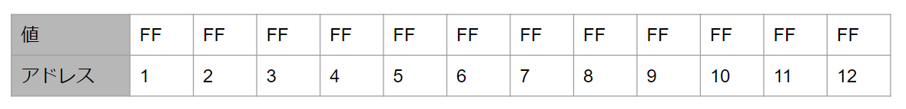
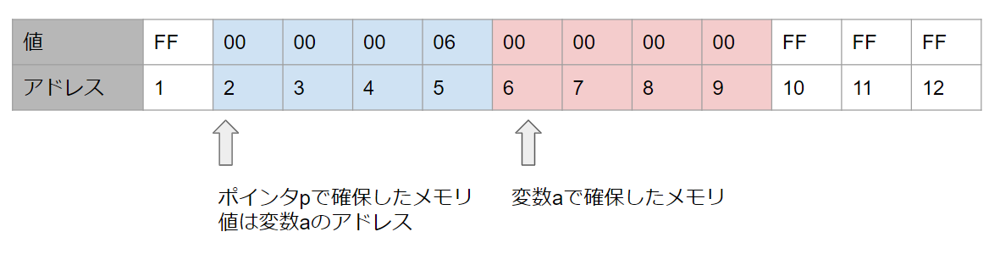

# ポインタ

ポインタは**メモリのアドレスを入れる変数**、以上です。

と言っても謎だと思うので、まずポインタを理解するために重要なメモリと変数について理解を深めていくところから入っていきたいと思います。


## メモリについて

メモリで抑えておくべき基本は**アドレス**と**値**の２つになります。



メモリは駅のコインロッカーをイメージするといいかもしれません。

アドレスはロッカーの番号に該当し、値はロッカーの中身に該当します。

またロッカーの大きさは1つのロッカーが**1byte(8bit)**という大きさになっています。


パソコンはこのメモリの**アドレス**を使って、メモリの特定の位置に**値**を入れたり、逆に取り出したりすることができます。


### ポイント１

メモリには**アドレス**と**値**があり、**アドレス**を使ってメモリに**値**を書き込んだり、メモリから**値**を読み込んだりするという基本をまず覚えて下さい。


### ポイント２

メモリのアドレスは一般的に16進数を使って表す事が多く、またパソコンは0と1で動いているという話を聞いたことがあるかもれませんが、2進数の知識もあると今後の理解に役立ちます。

今後の為に、以下の知識を覚えておくのもよいでしょう。


- 16進数、8進数、2進数
- ビット、バイト
- 1の補数、2の補数(パソコンがマイナスの数をどう表現しているかわかる)

- エンディアン(実際にメモリの中を見る際にはエンディアンの知識もあると良い)


16進数やビット、バイトに関しては以下の動画も参考になると思います。

https://youtu.be/m_eDfW0nDRM


## 変数を定義するということ

変数を定義するとはどういうことか、について詳しく見ていきます。

```c
// int型の変数aを定義する
int a;
```


「**変数a**を定義する」というのは「**変数a**で使用するメモリを確保する」と言い換えられます。


また、int型というのは一般的に4byteと大きさが決まっています。(環境によっては4byteでない事もある)

つまり「int型の変数を定義する」とは「4byte分のメモリを確保する」とも言えます。


実際、int型の変数aを定義した場合、メモリの中は以下のような状態となります。


変数aを定義するとメモリの中のどこか4byte分が変数aの為に確保されます。

今回はメモリの6番地の位置から4byte分のメモリが確保されたという事にしましょう。


**余談：番地という呼び方**

アドレスの事を番地と読んだりします。

メモリのアドレスは住所に似ていますし、住所に例えられる事も多いのでそれが由来かもしれません。

今回の場合であれば「メモリの6番地から4byte分のメモリを確保」と言ったりします。


**変数**というのはこの確保されたメモリの場所(アドレス)を覚えていて、**変数**を介する事で、プログラマーはメモリの特定の場所に**値**を書き込んだり、**値**を読み込んだりすることができるわけです。


**変数a**は6番地から4byte分のメモリに該当し、この場所に値を書き込んだり、読み込んだりできる存在として定義されたという事になります。


このように見ると、変数はプログラマーとメモリを繋ぐ、橋渡し的な存在だったという見え方になってくるのではないかと思います。


また変数の定義とは、**メモリを確保するだけ**なので、値の部分がどうなっているかは保証がありません。

というのものロッカーの中身は前に使っていた時に入っていたモノがそのままになっているため

メモリを確保した時点で何が入っているかはわからないからです。


今回の例であれば、変数aの値は16進数で表すと`0xFFFFFFFF`という事になります。


## 変数を初期化するとは

```c
// int型の変数aを初期化する
int a = 0;
```

変数の初期化とは、「変数を定義すると同時に、指定した値を入れる」という事になります。


前述したように、変数を定義しただけだと、変数の中身がどうなっているかは保証がなく、これが原因でバグったなんてこともあります。

念のため、変数を定義する際には、何かの値で初期化しておく癖をつけておくと良いでしょう。


変数の初期化について、メモリのイメージは以下のようになります。


## 初期化せずに代入する場合の動き

```c
// int型の変数aを定義し、0を代入する。
int a;
a = 0;
```

初期化ではなく、代入によって変数の値を0にする場合はどのようになるか解説します。


まずこの処理では、最初に変数aのためのメモリ(4byte)が確保されますが、この時点ではメモリの値は不定です。(値は適当です)


この後`a = 0;`という代入処理が行われる事によって、メモリの6番地から4byte分のメモリが0という状態になります。


初期化した場合と結果は同じですが、変数の気持ちになってみると

とりあえずロッカー4つぶん確保した後に、じゃぁ0入れてきてと頼まれると2度手間です。

それならロッカー確保する時に言ってよ...という気持ちになると思います。

このように初期化した方が無駄が少なく、処理としてもちょっと早かったりします。


プログラムの動く仕組みやメモリがどう扱われるかを知る事で、プログラムのコードを見ているだけでは違いが分かりにくい事も、明確に違いが見えてくるのではないかと思います。


また、最近はコンパイラも優秀なので、実際に書いたコードがそのままコンパイルされるのではなく、無駄な処理を無くしたり、早くなるように最適化が行われたりします。

今回、例に挙げた代入によって初期値を入れるような処理は、おそらく最適化されるかと思います。


## アドレス演算子

ポインタといいつつ、なかなかポインタの話が出てきませんが、もうしばらくお待ちください。

次は**アドレス演算子**というモノについて解説します。


変数というのは、確保したメモリの場所、つまり**アドレス**の情報をもっています。

**アドレス演算子**は、変数の**アドレス**を取得できる演算子になり、以下のように書きます。


```c
int a = 0;
&a; // 変数の前に&を付ける
```


**アドレス演算子**は**&**という記号を使い、変数の前に**&**を書くと、その変数のアドレスを表すようになります。


今回の例だと、変数aは4byteなので、アドレスは6~9までという事になりますが、基本的に変数のアドレスとは先頭のアドレスの事を指します。


変数には型があり、今回はint型なので確保しているメモリは4byteという事はわかっています。

なので先頭のアドレスさえわかれば、そこから4byte分が変数aの領域だという事がわかります。

変数に型を付けるのは、こういう意味でも大事になってくるわけですね。


以下のプログラムを書く事で、変数aのアドレスを表示することができるでしょう。

```c
int a = 0;
printf("%p", &a); // 変数aのアドレスを表示
```


メモリのどこが確保されるかはわからないので、実行するたびに表示されるアドレスが変わっている事も確認できるかと思います。


## ポインタ

いよいよポインタの話です。

冒頭で、**ポインタはメモリのアドレスを入れる変数**と書いておいたのですが、字のごとくそのまんまのモノです。


以下にポインタ(変数)を実際に書いてみます。

```c
int a = 0;
int *p = &a; // pは変数のアドレスを入れるための変数で、変数aのアドレスを入れている。
```


ポインタは中身にメモリのアドレスが入るというだけで**ただの変数**です。

アドレスを入れる変数の事を特別に**ポインタ**と呼んでいます。


例えば、値が変わらない変数の事を変数とは呼ばず、**定数**と呼ぶ事はあるかと思いますが、ポインタもそれと同じようなものです。


- 値が変わらない変数→定数
- 値が変わる変数→変数
- アドレスが入る変数→ポインタ


変数の役割に応じて呼び名が少し違うだけのことです。


ポインタ変数は以下のように定義します

```c
// 型 *変数名
int *p;
```


変数の前に`*`という記号を付けるという以外は、普通の変数と基本的に同じです。

この場合は「**int型の変数のアドレス**を格納する変数pを定義」しています。


また`*`の位置は型の方に寄せる書き方でも問題はありません。

```c
// 型* 変数名
int* p;
```

**余談**

ポインタを定義する時の`*`は、左寄せ派と右寄せ派がおり、変数に寄せる右寄せ派の方が良いとされている気がするのですが、僕は長いこと左寄せで書いてきてしまったため、左寄せの方がしっくりきてしまいます。


話が逸れましたが、以下の処理について、メモリの中がどうなっているかも見ていきましょう。

```c
int a = 0;
int *p = &a; // pは変数のアドレスを入れるための変数で、変数aのアドレスを入れている。
```


まず`int a = 0;`という処理によって、変数aのために4byte分のメモリが確保されます。

確保したのは6番地から4byte分としておきます。


次に`int *p = &a;`という処理ですが

これはポインタ変数`p`を確保すると同時に、変数`a`のアドレスで初期化すると言う処理になります。


①ポインタも変数なので、ポインタ変数用のメモリが確保される(2番地から4byteという事にする)

②変数aのアドレスで初期化しており、変数aのアドレスは6番地なので、ポインタの値は`6`になる。



このような感じで、メモリの中を見てしまえば、ポインタもただの変数ですし、ただ値の部分にメモリのアドレスが入っているだけとなります。


### ポインタのサイズについて補足

今回、ポインタ用にメモリを4byte確保しましたが、ポインタのサイズは32bit環境ならば4byte、64bit環境であれば8byteとなります。

今回の例では4byte確保したので、32bit環境の場合の例という事になります。

(メモリの図は12byteといううんちみたいなメモリなので、8byteとか使うとそれだけで枯渇寸前です)


32bitマシンだと、メモリを4ギガ以上積んでも認識されないとう話を聞いたことがある人もいるかもしれません。

それはポインタのサイズが32bit(つまり4byte)で表せるメモリの番地が4ギガまでだからという事になります。

メモリのアドレスが分からなければプログラム内部でそのメモリにアクセスする事ができません。

メモリをいくら積んだところで4ギガ以降のアドレスを表現できない、つまり認識できないので、4ギガが限界だったというお話ですね。


## まとめ

今回の内容はここまでとします。

**ポインタというのはただメモリのアドレスが入る変数ですよ**という話しかしてないのですが、言ってしまえばポインタというのはそれだけのものです。

まずはそれをしっかりと抑えてしまうのがポインタを理解するうえで手っ取り早いのではないかなと個人的には思います。


またメモリのアドレスさえわかっていればその場所に値を書き込んだり、読み込んだり、まぁ色んな事ができるというのがパソコンの基本の仕組みであるため、メモリのアドレスを保持するポインタを使えば、色んな事ができてしまいます。


次回以降があるかはわかりませんが、ポインタは色んな事ができるため

幅広い用途がありますし、メモリを自由に触れてしまう側面もあるため、メモリを破壊するのも簡単です。

そのため扱いは慎重になる必要がありますが、ちゃんと理解してしまえば

普通に使う分にはさほど危険でもないかなと思っています。

このご時世、C/C++でポインタを実際に使うのは一部の限られた業界(組み込みやハイエンドゲーム)だと思いますが

使うかどうかではなく、仕組みを知るのは、プログラムという世界にいる限りどの分野においても有用な知識となるものだと思います。


