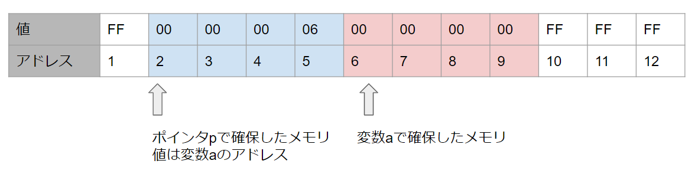
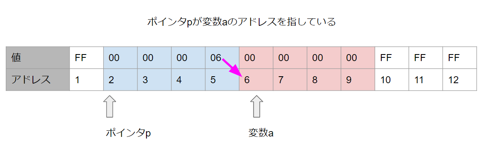
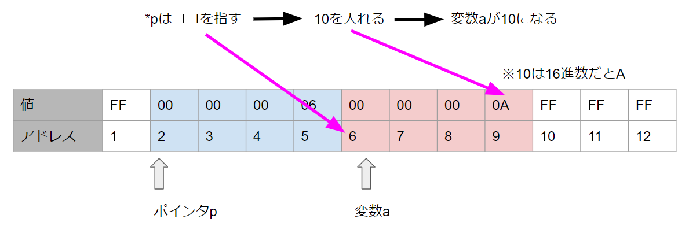
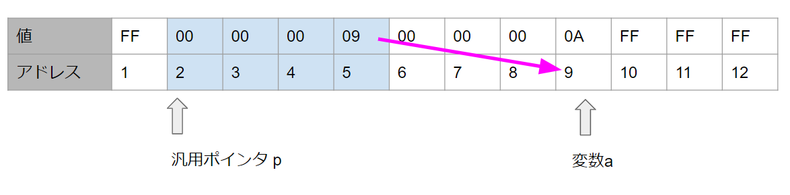

※これは読み物ではなく、私が説明する上での資料です。

※また**私が**ポインタを理解した方法をまとめているものです。


# 間接参照演算子

何やら難しい言葉がでてきましたが、[前回やったポインタ](../09_01_pointer/index.md)の続きのお話です。

前回、メモリのアドレスが分かってればそのアドレスに対して色々できるんだとざっくりした事を書きましたが、今回はポインタを使ってメモリの値を取得したり、値を書き込んだりするお話になります。


## 本題に入る前にちょい補足

そういえばポインタの基本については書いたけど、ポインタに代入したりとか全く触れてなかった、と思ったのでそこらへんも書いておこう。

```c
// 変数を2つ用意
int a = 0;
int b = 10;

// ポインタを1個用意
int *p = NULL; // いわゆるヌルポインタ、ぬるぽで初期化

p = &a; // 変数aのアドレスを代入
p = &b; // 変数bのアドレスを代入
```

ポインタを定義するときは`*`という記号を使うけれど、ポインタにアドレスを代入したりする際は他の変数と同じように変数名だけでOK

このあたりの書き方はのちに、ポインタ混乱民を大量に生み出している気もするけど、慣れです。

では本題へ移っていきます。


## ポインタが変数を指すとは

```c
int a = 0;
int *p = &a; // pは変数のアドレスを入れるための変数で、変数aのアドレスを入れている。
```


こんなコードがあったとき、メモリの中身はこんな感じになってますというのを前回やりました。




このような状態を「`ポインタp`が`変数a`を指す」と言ったりします。

図にすると以下のようなイメージです。




# 間接参照演算子

**間接参照演算子**という言葉を見ると、とりあえず漢字多すぎという印象しかありませんが、まぁ覚えるしかありません。


今回の処理では、以下のような状態になっています。

- `ポインタp`には6番地というアドレスが入っている
- 6番地というのは変数aがいる場所

この場合、**間接参照演算子**を使う事で、ポインタを介して間接的に変数a(のメモリ)を扱う事ができます。


### ポインタを使って変数aの値を表示するサンプル

```c
int a = 0;
int *p = &a;

printf("%d\n", *p); // 0と表示される。
```

`printf`の第二引数の部分で`*p`と書いていますが、このポインタの前に書いている`*`が**間接参照演算子**になります。

こう書く事で`ポインタp`の指す`変数a`を**間接的に参照**し、`変数a`の値である`0`が表示されることになります。


今回の例だと、`*p`と`a`は実質同じモノを表す事になります。

なので**間接参照演算子**と`ポインタp`を使えば、変数a(の場所)に値を格納する事もできます。

```c
int a = 0;
int *p = &a;

*p = 10; // a = 10;と同じこと

printf("%d\n", *p); // 10と表示される。
printf("%d\n", a); // 10と表示される。
```

`*p = 10`という処理をメモリでイメージすると、私の脳内ではこんな感じになっています。



変数aを直接いじったわけじゃないですが、`*p`で間接的にメモリの値を変えたので、変数aの値は10になっているということになります。


※ポインタを学ぶと、**ポインタを定義**するときにも`*`を使い、**間接参照演算子**でも`*`という記号を使うので混乱する人が多いそうですが、**定義**と**参照**で用途が違うのに、記号が同じなので混乱する気持ちはわかりみ。

まぁここは慣れるしかないでしょう、人生だって同じことしてもうまくいくかどうかはわからないわけです、大事なのは**タイミング**


### 余談①

前回学んだアドレス演算子`&`と今回やった間接参照演算子`*`を組み合わせると以下のような処理も動きはします。(こんな処理は書きませんし、ただのネタコードです)

```c
int a = 10;
int* p = &a;

printf("%d\n", *&*&*&*&*&*&*&*&*p); // 10と表示される
```


`*p`は`a`と同じ、`&a`は`p`と同じ事なので、以下のような流れで最終的には変数aという事になります。

```c
*&*&*&*p;
*&*&*&a;
*&*&*p;
*&*&a;
*&*p;
*&a;
*p;
a;
```


### 余談②

`*p`と`変数a`は実質同じといいつつ、実際どうなんだろうなと逆アセンブルしてみました。(実際アセンブリはそんなによくわかってない)

```c
*p = 10; // 間接参照
a = 10;  // 直接代入
```

こんなコードを書いてみたところ、これは以下のように変換されていました。

```c
*p = 10;
00FF484F  mov         eax,dword ptr [p]  
00FF4852  mov         dword ptr [eax],0Ah  
    
a = 10;
00FF4858  mov         dword ptr [a],0Ah  
```


**間接参照演算子**を使う場合、2ステップ、直接変数に代入する場合は、1ステップの処理に変換されるみたいですね。結果的には同じことが起こりますが、低レイヤーで見てみると違いが見えた気もしました。


## Tips ポインタの型ってなんだろうか

前回、ポインタのサイズは32bit環境だと4byte、64bit環境だと8byteという話をしたのですが

つまり、ポインタは型なんてなくてもメモリのサイズは決まっているわけです。

だとしたら、ポインタに型なんているんだろうか？という疑問を抱く人もいるかもしれません。

```c
int *p1;  // int型のポインタだろうと
char *p2; // char型のポインタだろうと、メモリ的には同じサイズじゃねぇ？
```


というわけで、例えばポインタの型がわからなかったらどうなるかということを、今回学んだ**間接参照演算子**を例にして見ていきたいと思います。


ポインタには**汎用ポインタ**というものがあります、とりあえずアドレスが入るポインタです。

```c
void* p; // 汎用ポインタ
```


こんな処理があったとします

```c
int a = 10;
void* p = &a; // pにはaのアドレスが入る
```


この時、`*p`について考えてみます(実際これ書くとエラーになると思いますが)

```c
*p; // pには変数aのアドレスが入っているが、間接参照演算子を付けると？
```


メモリの中で見ると、汎用ポインタであれ、ポインタはポインタです。メモリも4byteです(32bit環境なら)

また汎用ポインタは変数aの場所を指しています。



この時、汎用ポインタは9番地というアドレスはわかっていますが、逆に言えばそれ以外の事がわかりません。

変数aが`int型`だとわかるならば**9番地から4byte**とわかりますし、メモリの値を**整数として扱うのだ**という事がわかるのですが

汎用ポインタは型の情報がないため、アドレスはわかったけど、そこにあるものを**どう扱っていいのかがわからない**、よって**間接参照演算子**で参照することが出来ないという事になるわけでした。


ポインタならサイズ決まってるから型いらなくねぇ？と思ったのは他ならぬ私なわけですが、型がいらないとはならないわけでした。


