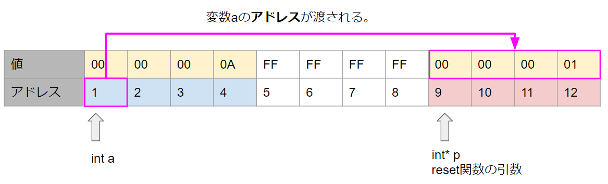

# 値渡しとポインタ渡し

今回もポインタ関係の話で、[前回の続き](../09_02_pointer/index.md)となり、関数と関連の深い**値渡し**と**ポインタ渡し**に関する資料になります。

また巷で参照渡しって何？という人も多く見かけますが、そんな参照渡しとも近いお話です。


## 細かい話

さっさと本題に入りたいところですが、**ポインタ渡し**という言葉は人によっては**参照渡し**だったり**アドレス渡し**だったりと言葉の使われ方が結構曖昧なので、その点について整理しておきたいと思います。


① 突然C++の話ですが、C++には**値渡し、参照渡し、ポインタ渡し**の3種類が存在します。

② **参照渡し**と**ポインタ渡し**は似ているのですが、厳密には異なります。

③ C言語の世界には**値渡し**と**ポインタ渡し**しかなく、C++でいうところの**参照渡し**は存在しません。

④ **ポインタ渡し**は**アドレス渡し**とも呼ばれます


| 名称                       | C    | C++  |
| -------------------------- | ---- | ---- |
| 値渡し                     | ある | ある |
| 参照渡し                   | ない | ある |
| ポインタ渡し(アドレス渡し) | ある | ある |

まとめるとこんな感じです。


C言語で**参照渡し**という言葉が出てきた場合、動作としてはC++の**ポインタ渡し(アドレス渡し)**に該当します。

※この資料では**参照渡し**と**ポインタ渡し**の細かい違いについては触れません。


## 値渡しとは

**ポインタ渡し**の前に、以下のプログラムを参考に、**値渡し**というのは一体なんだってばよという事と

メモリの中はどうなってるんだぜ？という部分をを見ていきたいと思います。

```c
#include <stdio.h>

void reset(int p) {
  p = 0;
}

int main(void)
{
  // ①変数を10で初期化
  int a = 10;

  // ①関数実行
  reset(a);
	
  // ③aの値を表示
  printf("%d", a); // 10と表示される
  return 0;
}
```


### ①変数を10で初期化

`int a = 10;`という処理では、変数aのためにメモリが確保され、そこに`10`という値が格納されます。

メモリはこんな感じ、今回は1番地から4byteのメモリを確保したことにしましょう。


### ②関数実行

次に関数を実行する部分について、メモリの中について迫っていきたいと思います。


以下では`reset関数`を実行していますが、関数を呼び出すときにはまず、**この関数を動かすのに必要なメモリ**が確保されます。

```c
// ①関数実行
reset(a);
```


**関数を動かすために必要なメモリ**というのは細かい事を言えばあれこれとあるのですが、今回は変数について着目します。

`reset関数`は引数で`int型の変数`を受け取るようになっていますが、**引数も変数ですのでメモリが必要**です。

```c
void reset(int p) {
  p = 0;
}
```


メモリは以下のような感じで、`reset関数`で使う`変数p`のためにメモリを確保します。


そして関数を呼び出すときに引数に`a`を指定していますが、これは今しがた確保した`引数p`のメモリに`変数a`の**値を渡す**ということになります。

```c
reset(a);
```


メモリではこんな感じになります。


次は`reset関数`の中について見ていきます。

```c
void reset(int p) {
  p = 0;
}
```


この処理では`p`に`0`を代入しているので、メモリの中は以下のようになります。


そして関数の処理が終わると、関数の為に確保したメモリは自動的に解放されます。


### ③aの値を表示

この状態で、`変数a`を表示するとどうなるかといえば、メモリを見れば明らかだと思いますが

`変数a`の値は`10`なので、`10`が表示されるというわけです。


```c
// ③aの値を表示
printf("%d", a); // 10と表示される
```


今回の`reset関数`というのは、自分のために用意されたメモリの中身を書き換えて、そのメモリはすぐに解放されるので、何もしていないわけではないけれど、意味のある事はしていない処理になっているというわけです。


これが**値渡し**と呼ばれるものになります。

次に**ポインタ渡し**について解説していきますが、実質**やっていることは値渡しと違いがない**です。

ただ**渡すモノが違うだけ**です。


## ポインタ渡しとは

関数の引数にメモリのアドレスを渡すことをいいます。

今回は以下のプログラムについて、またメモリの内部を追っていきたいと思います。

```c
#include <stdio.h>

void reset(int* p) {
  *p = 0;
}

int main(void)
{
  // ①変数を10で初期化
  int a = 10;

  // ①関数実行
  reset(&a);
	
  // ③aの値を表示
  printf("%d", a); // 0と表示される
  return 0;
}
```


### ①変数を10で初期化

`int a = 10;`という処理によって、変数aのためのメモリが確保される、これは値渡しと同じです。


### ②関数実行

以下の関数実行について見ていきます。

```c
reset(&a);
```


関数実行も値渡しと同じで、まず関数に必要なメモリが確保されます。

`reset関数`の引数は`int* p`でポインタだという違いはありますが、今回はポインタも4byteという事にするので、メモリの中的には値渡しの時と同じです。


関数を呼び出す際に、`reset(&a);`として、`引数`に`変数a`の**アドレスを渡して**いますので、`引数p`には`変数a`の**アドレス**が渡されます。

この処理の場合は**ポインタ渡し**というより**アドレス渡し**の方がしっくりきますね。




次に`reset関数`の内部について見ていきます。

```c
void reset(int* p) {
  *p = 0;
}
```


`*p = 0;`という処理をしていますが、これはポインタがさす場所の値を0にするということです。

現状だと`*p`は`変数a`を指しているので、**変数aの値が0になる**ということになります。


メモリのイメージも確認しておきます。


そして関数の処理が終わると、関数のために確保したメモリは解放されます。


### ③aの値を表示

この状態で、`変数a`を表示するとどうなるかといえば、メモリを見れば明らかだと思いますが

`変数a`の値は`0`なので、`0`が表示されるというわけです。


```c
// ③aの値を表示
printf("%d", a); // 0と表示される
```


メモリの中で見れば特別な事をしている感じはしないというか、今まで解説してきたことを正しく理解していれば、「うん、まぁそうなるよね」というだけの話かとは思います。


## ポインタ渡しとアドレス渡し

```c
#include <stdio.h>

void reset(int* p) {
  *p = 0;
}

int main(void)
{
  // ①変数を10で初期化
  int a = 10;
  int* p = &a;

  // ①関数実行
  reset(&a); // A.アドレスを渡してる
  reset(p);  // B.ポインタを渡してる
	
  // ③aの値を表示
  printf("%d", a); // 0と表示される
  return 0;
}
```

ポインタ渡しとアドレス渡しという言葉がある背景については、上記の`reset`を呼び出す部分の処理で**変数のアドレスを渡す書き方**もできるし、**ポインタを渡す書き方**も出来るので2つの呼び方があるのだと思います。

どっちにせよ渡しているのは`変数a`の**アドレス**です。


## まとめ

今回は**値渡し**と**ポインタ渡し**についてメモリに言及した解説をしてみました。

また、巷では**ポインタ渡し**という言葉はあまり聞かないかもしれませんが、**参照**とか**参照渡し**という言葉はなじみ深いとも思います。

**参照**という言葉は、**変数の参照先**、つまりメモリ上のアドレスを意味しています。


**変数の参照先(アドレス)を渡す**ので**参照渡し**と呼んでいるわけで、**ポインタ渡し**とかなり近いものです。


配列やクラスは全て参照型というのを聞いたことがあるかもしれませんが、基本的に配列やクラスインスタンスを関数に渡すと、勝手に参照(アドレス)が渡されます。

なので関数の中で配列とかクラスインスタンスの値を変更すると、大元が変更されるという仕組みだったわけでした。


# Tips①：値渡しでもアドレスが渡ってくれば...

以下の処理は普通はこんな書き方はしませんが、道理さえ通っていれば動きはしますよというコードです。

C言語は良くも悪くも書いたとおりに動きますので、危険なコードやトリッキーなコードでも道理さえ通ってれば動くのです。

実務でこんなコードを書いていたらビンタものですが、個人でいろいろ試して検証する分には良い言語ですね😊

```c
#include <stdio.h>

void reset(int p) {
    // pはint型だけど、中身の数値は変数のアドレスが入ってるというのであれば
    // 無理やりint型のポインタにキャストして、ポインタとして扱ってしまうこともできる
	*((int *)p) = 0;
}

int main(void)
{
  int a = 10;

  // アドレスといってもただの数値なので、int型に渡す事は可能
  reset(&a);
	
  printf("%d", a);
  return 0;
}
```


# Tips②：関数を実行するとは？

関数を実行する、はたまた関数を呼び出すと言ったりもしますが、そもそも関数呼び出しとはなんなのか、について少し触れます。

関数というのも、メモリのどこかに存在していて、関数の存在する場所(つまり関数のアドレス)というものがあります。


メモリのイメージとしてはこんな感じです


コンピューターがプログラムを実行する時は**プログラムカウンタ**といって、今実行している処理の場所(アドレス)を保持していて、**プログラムカウンタ**が示している場所にある処理を実行しています。

処理が実行されると、**プログラムカウンタ**が増え、またその場所の処理を実行するという事を繰り返しています。


上記のメモリの例であれば

**プログラムカウンタ**に`11`が入っていれば`main関数`の最初から処理が動きますし

**プログラムカウンタ**に`21`を入れてしまえば、`reset関数`の最初から処理が動くというシンプルなものです。


**関数を呼び出す**というのは、**プログラムカウンタ**に処理したい場所のアドレスをセットするという事になります。


ちなみに関数名というのはその関数の存在するアドレスを表しています。

今回例にしていた`reset関数`の呼び出しについてさらに細かく突っ込んでみると


```c
// 関数名というのは関数のある場所→つまりアドレスである
reset(a);

// reset関数のアドレスが0x12345678だったとすると
// 以下のように書いても同じことである。
0x12345678(a);
```


C言語の書籍とかで、演算子の章をよく見てみると`()`が関数呼び出しという演算子で登場しているのではないかなと思います。

`()`という演算子は、`()`の前にあるアドレスを**プログラムカウンタ**にセットしつつ、その関数に必要なメモリを確保するという**演算**を行うものだったというわけですね。
