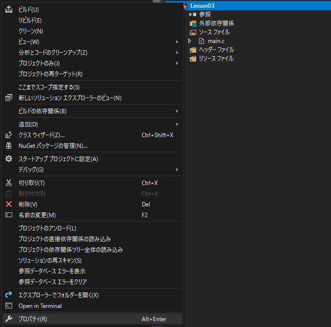
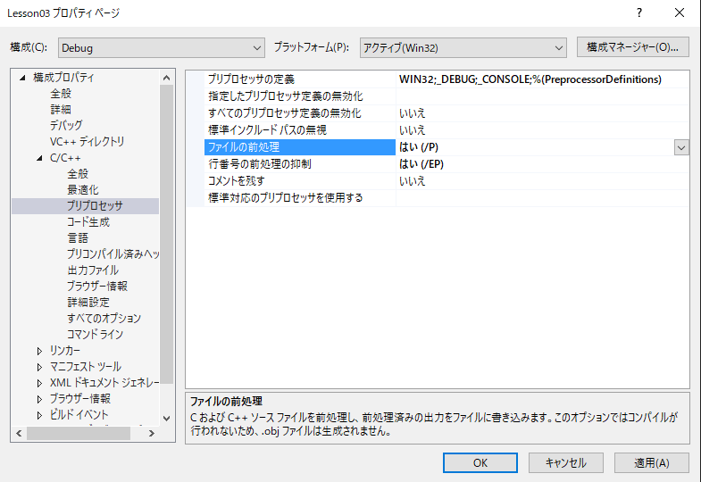
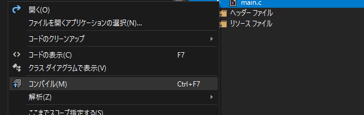
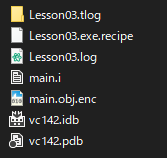

# プリプロセッサ

私も細かい部分は曖昧な理解のままになっているということを予め伝えた上で、知っていても損はないし、知っていた方がいいだろうというプリプロセッサに関するお話をまとめておきます。


プリプロセッサとはC言語では先頭が`#`から始まるもので、`#include`や`#define`などいくつか種類があります。


## プリプロセッサの前に

プリプロセッサの話に入る前に、まず**ソースコード**と**実行ファイル**に触れておきます。

C言語で書かれたソースコードはただのテキストファイルであり、いわばソフトウェアの素です。

実際にコンピューターで実行できるモノは、**実行ファイル**や**実行バイナリ**と呼ばれたりします。


何はともあれ、ソースコードを元に実行ファイルを作る、これが基本となります。

```
ソースコード → 実行ファイル
```


このソースコードを実行ファイルに変換する者が**コンパイラ**や**リンカー**と呼ばれるモノたちです。


おそらくC言語の入門書などでも、ソースコードをコンパイルする事でオブジェクトファイルが出来上がり、オブジェクトファイルを繋げる(リンク)する事で実行ファイルができるという解説があるかと思います。


ソースコードが実行ファイルになる作業工程には**コンパイル**と**リンク**という工程があるわけです。

```
ソースコード→コンパイル→リンク→実行ファイル
```


### 🙋‍♂️お役立ちポイント

今時コンパイルやリンクを自分でどうこうするという事はあまりないかもしれませんが、ブラウザで3D描画ができる`WebGL`などではこの知識はバリバリ有用です。

WebGLを書く場合、`shader`と呼ばれるGPUで動作する絵を描くためのプログラムを書き、これをJavaScriptでコンパイルしてリンクするという処理を実際に書いたりします。

コンパイルやリンクについて知識があれば、実際にやるときに理解の助けとなることでしょう。


話を戻しますが、今回の本題である**プリプロセッサ**は**前処理**とも呼ばれ、基本的にコンパイルの前に処理されるものになります。


```
ソースコード→プリプロセッサ→コンパイル→リンク→実行ファイル
```


このプリプロセッサでは何が行われるのか、具体例をこの後いろいろ見ていきたいと思います。


## プリプロセッサが動いた後の状態

プリプロセッサが動いた後、ソースコードがどうなっているのかを確認する事もできます。

`Visual Studio`で実際に確認する方法も資料の最後に記載しておきますが、ひとまずは元のソースコードとプリプロセッサが動いた後のソースコードを比較しながら理解を深めていきたいと思います。


まずは最小のプログラムから確認していきます。

```c
int main(void)
{
	return 0;
}
```

このプログラムはプリプロセッサが動作すると以下のコードになりました。


```c
int main(void)
{
	return 0;
}
```

特にお変わりはないようですね。


# `#define`

以下のコードを見ていきます

**ソースコード**

```c
#define RESULT 0

int main(void)
{
	return RESULT;
}
```


**プリプロセッサ適用後**

```c
int main(void)
{
	return 0;
}
```


プリプロセッサ適用後には以下の変化がありました。

- `#define RESULT 0`の行がなくなった
- `return RESULT;`→`return 0;`に変わった


`#define`というのは文字列を単純に置き換えるプリプロセッサなので、プログラム内の`RESULT`と書かれていた部分が`0`に置き換わったわけです。


プログラマーが書いたソースコードはこのようにプリプロセッサによって変換が入り、変換された後のモノが**コンパイラ**に渡されます。


なので、細かい事を言えば、自分が見ているソースコードと、コンパイラが受け取るソースコードは別物という点は知っておいても損はないかなと思います。


`#define`で何かしら定義する事を**マクロ**と言ったり、**マクロ定義**と呼んだりします。

この資料でも今後この言葉を使うので慣れていってください。


# `#if ～ #endif`

今度は以下のコードについて見てみます。


**ソースコード**

```c
int main(void)
{
#if 0
	int a = 0;
#endif
	return 0;
}
```


**プリプロセッサ適用後**

```c
int main(void)
{
	return 0;
}
```

`#if 0 ～ #endif`はこの間に書かれているソースコードが無効(なくなる)になります


`#if 1 ～ #endif`のように書くと、この間に書かれているコードが有効になります。

**ソースコード**

```c
int main(void)
{
#if 1
	int a = 0;
#endif
	return 0;
}
```


**プリプロセッサ適用後**

```c
int main(void)
{
	int a = 0;
	return 0;
}
```


あまり使わないですが、開発途中だと、一時的にこの部分の処理を有効にしないな、無効にしたいなという時があったりもします。

コメントにしてもいいですが、危険な処理を書いている場合などは、**実際の処理の部分には一切手を加えずに有効/無効が切り替えられる**という安心感は捨てがたいものです。


また以下のように`#else`と組み合わせる事で、2つの処理を切り替えて動作を確認しやすくするという使い方をする事もあります。

```c
int main(void)
{
#if 1
	int a = 0;  // #if 1ならこっちを採用
#else
	int a = 10; // #if 0ならこっちを採用
#endif
	return 0;
}
```


`#if 1`の時の結果

```c
int main(void)
{
	int a = 0;
	return 0;
}
```


`#if 0`の時の結果

```c
int main(void)
{
	int a = 10;
	return 0;
}
```

※プログラム内のコメントもプリプロセッサの工程で削除されています。


# `#ifdef ～ #endif`

次に`#ifdef`について見ていきます。

これは`#if`に近いですが、結構便利でよく使われます。


以下のコードについて見ていきます。


**ソースコード**

```c
#define HOGE

int main(void)
{
#ifdef HOGE
	int a = 0;
#endif
	return 0;
}
```


**プリプロセッサ適用後**

```c
int main(void)
{
	int a = 0;
	return 0;
}
```


`#ifdef HOGE`というのは`HOGE`というマクロが定義されていれば有効というものになります。

つまり、**マクロが定義されているかどうかでプログラムの内容を変えられる**ということになります。


`#define HOGE`を消した場合についても記載しておきます。


**ソースコード**

```c
int main(void)
{
#ifdef HOGE
	int a = 0;
#endif
	return 0;
}
```


**プリプロセッサ適用後**

```c
int main(void)
{
	return 0;
}
```


`HOGE`が定義されていないので、`#ifdef ～  #endif`の間の処理がなくなります。


# `#include`

`#include`がおそらく一番初めに書かされるものな気はしますが、紹介が遅れてしまいました。

以下のソースコードについて見ていきます。


**ソースコード**

```c
#include <stdio.h>

int main(void)
{
	printf("Hello World");
	return 0;
}
```


**ソースコード適用後**

```c
#pragma once
#pragma once
#pragma once
#pragma once
#pragma region Input Buffer SAL 1 compatibility macros
#pragma endregion Input Buffer SAL 1 compatibility macros
#pragma once
#pragma once
#pragma pack(push, 8)
#pragma warning(push)
#pragma warning(disable:   4514 4820 )

~~~~~~~~~~~~~~~めちゃくちゃ長いコード~~~~~~~~~~~~~~~~~~~

int main(void)
{
	printf("Hello World");
	return 0;
}
```


あまりにも長いので途中省略しましたが、`#include`というのは文字通り、指定したファイルの中身をそのまんま持ってきます。


`stdio.h`の中身は難しそうな事が沢山かかれていて、それが`include`、実際に含まれると上記のような結果になります。


この長い処理のどこかに、お馴染みの`printf`であったり`scanf`の事が書かれていて、`#include <stdio.h>`と書く事で、その処理を全部ガッっと持ってきます。

なので`stdio.h`を読み込むと、`printf`や`scanf`が使えるようになるわけです。


# `scanf`でエラーがでる問題について

C言語の入門書で良く登場する`scanf`関数を使うと、以下のようなエラーがでてもうダメだ...となる事があるかと思います。


```
エラー	C4996	'scanf': This function or variable may be unsafe. Consider using scanf_s instead. To disable deprecation, use _CRT_SECURE_NO_WARNINGS. See online help for details.
```


> 'scanf'を使用しています。この関数または変数は安全でない可能性があります。代わりにscanf_sの使用を検討してください。非推奨を無効にするには、_CRT_SECURE_NO_WARNINGSを使用してください。詳細はオンラインヘルプを参照してください。

翻訳するとこんな感じになりました。


要するに`scanf`ではなく、`scanf_s`を使ってねという話ですが、`scanf`を使いたいなら`_CRT_SECURE_NO_WARNINGS`マクロを定義してねと言っています。


エラーに従い、以下のように`#include<stdio.h>`の前に`#define _CRT_SECURE_NO_WARNINGS`マクロを定義する事で`scanf`が使えるようになります。

```c
#define _CRT_SECURE_NO_WARNINGS
#include <stdio.h>

int main(void)
{
	int a = 0;
	scanf("%d", &a);
	printf("%d", a);
	return 0;
}
```


なぜこれで`scanf`が使えるのか？というのは、プリプロセッサを知らないと謎かと思いますが、C言語などは**マクロが定義されているかどうかで処理を切り替える事ができる**という話を前の方で書きました。


この仕組みを使って`_CRT_SECURE_NO_WARNINGS`が定義されていたら、`stdio.h`の中で`scanf`が使える処理が有効になるという仕組みになっているというわけです。


このようにマクロの定義によって処理を切り替えるというのはよく使いますし、このはC言語だけでなく、C++やC#などの言語でも同様の事が可能になっています。


## プリプロセッサ適用後のファイルを見る

`Visual Studio`でプリプロセッサ適用後のファイルを見る方法を記述します。


①ソリューションエクスプローラからプロジェクトを選択し右クリック→プロパティを開きます。




②構成プロパティ > C/C++ > プリプロセッサと進み、以下の設定を有効にし適用します。

ファイルの前処理→はい(/P)

行番号の前処理の抑制→はい(/EP)



※実際には**ファイルの前処理**を**はい**にするだけでいいのですが、この資料では**行番号の～**も有効にしています。


③プリプロセッサ適用後の状態が見たいファイルを右クリックします。


④コンパイルを選択します



これをすると`main.c`のプリプロセッサが適用された後の`main.i`というファイルが出来上がります。

(Debugモードであればソリューションのあるディレクトリの中のDebugというフォルダの中に出来ると思います。)




この`main.i`というファイルを見る事でプリプロセッサが適用された後の内容を確認する事ができます。


**注意事項**

プロジェクトの設定を元に戻さないと、普通にビルドしようとしたときにエラーになるので、確認し終わったらプロジェクトの設定は元に戻しておきましょう。


## まとめ

以上でプリプロセッサに関する解説は終了です。
