# デバッグ方法

`Visual Studio`を使ったプログラムのデバッグ方法の資料


いったん以下のプログラムを例にデバッグ基本的なやり方を紹介します。

```c
#include <stdio.h>

int main(void) {

	int a = 0x12345678;

	char text[] = "ABCDE";

	return 0;
}
```


## ブレークポイント

ブレークポイントは以下の画像のように、プログラムの行数の左側の部分をクリックする事で設置する事ができます。

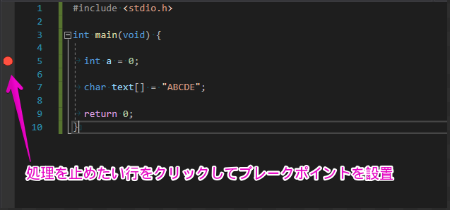


ブレークポイントを置いた状態でプログラムの実行をすると、その位置で処理が一時停止します。

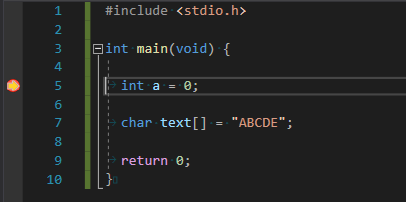


## ステップ実行

ブレークポイントで処理を止めた状態で、**F10**キーを押すと、1行ずつプログラムを実行する事ができます。


## ウォッチ

ウォッチは変数の中身を確認する事ができるデバッグツールです。

デバッグ実行中は`Visual Studio`に以下のようなモノが表示されると思います。

下のタブから「ウォッチ」を選択して、名前のところに確認したい変数名を入力するとその変数の内容を確認する事ができます。

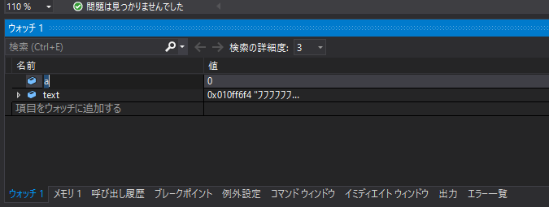

※ウォッチが表示されていない場合は、`Visual Studio`上部の**デバッグ**から表示させる事ができます。


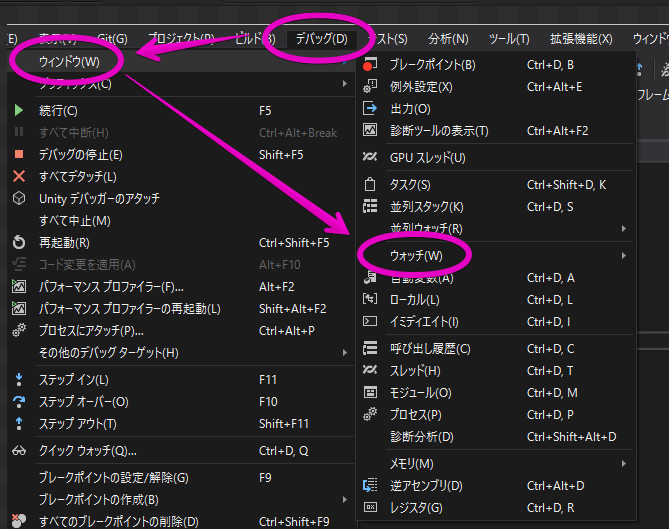

デフォルトで表示されていないツールもあるので、必要に応じてここから表示させることができます。


## メモリウィンドウ

メモリウィンドウでは、メモリのアドレスを指定して、そのアドレス周辺のメモリの値を見る事ができます。

デフォルトでは表示されていないと思うので、`デバッグ > ウィンドウ > メモリ`でメモリツールを表示させます。

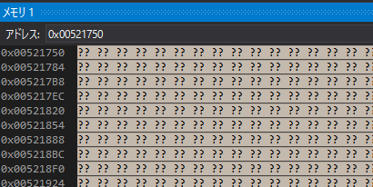


### 変数のメモリを見る

アドレスの欄に`&a`として変数のアドレスを指定するとその変数がある場所が表示されるようになります。

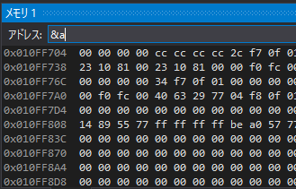


※アドレスの欄は自動的に16進数になります。

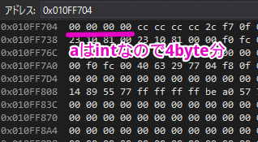


メモリは1byte単位で区切られ、16進数で表示されます。

1byteで表せる数は10進数では0～255までとなり、これは16進数だと`00`～`FF`となります。

上記は`変数a`を表示していて、`a`は`int型`=`4byte`となるため、メモリ4つ分が`変数a`に該当します。


### エンディアンの話

`int a = 0`だとわかりにくいので、`0x12345678`で初期化した状態でメモリを見てみます。

```c
int a = 0x12345678;
```


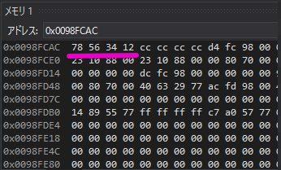

メモリを見るとわかると思いますが、`0x12345678`ではなく`0x78563412`と表示されていて、順番がおかしくなっているかと思います。

これはメモリにデータを格納するときにコンピューターが高速に処理しやすい順番があり、それに合わせるために実際のコードとメモリの配置が逆になっています。


このデータの配置順の事をエンディアンといって

- `0x12345678`を`0x12346578`とそのままメモリに格納するのをビックエンディアン(大きい桁から先に格納)

- `0x12345678`を`0x78563412`と逆にしてメモリに格納するのをリトルエンディアン(小さい桁から順に格納)

と呼びます。


Windowsはリトルエンディアンのため、このような結果になります。

そこまで意識する必要はありませんが、Windowsでメモリを見る場合は、メモリ配置がリトルエンディアンだという事は知っておかないと、あれ？値がおかしいってなる事があるのでその点だけ抑えておくといいと思います。


### 文字列の正体を見る

以下の文字列がメモリの中でどのようになっているかも見てみます。

```c
char text[] = "ABCDE";
```


アドレス欄には、配列の場合は変数名がアドレスそのものを表すので`&text`ではなく`text`と入力します。

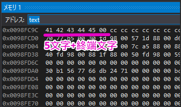

`char型`は1byteなので、メモリ1つが1文字に該当しています(アルファベットなら)


英数字や一部の記号はASCIIコードと呼ばれ、どの文字がどの数値に対応するかというのは下記のサイトでも確認することができます。

http://www3.nit.ac.jp/~tamura/ex2/ascii.html

Aが`0x41`でそこから連番になっている事が分かるかと思います。


またメモリの右側にはよくわからない文字が表示されていると思いますが、これはメモリの中身をASCII文字で表示したらどうなるかというものです。


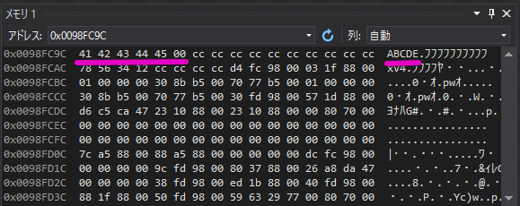


プログラムの場合は`char`や`int`などデータの型を意識しますが、メモリの中はそんなものは関係なくただの数値の羅列しかありません。

なので以下のプログラムは見た目は違いますが同じ事になります。

```c
char text[] = "ABCDE";
```

```c
char text[] = {0x41, 0x42, 0x43, 0x44, 0x45, 0x00};
```

```c
char text[] = {65, 66, 67, 68, 69, 0};
```


### メモリを直接書き換える

メモリウィンドウはカーソルを合わせて、普通にキーボードで値を書き換える事ができます。

まさにメモリの中の値を直接書き換える行為です。

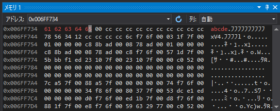

今回は`ABCDE`を`abcde`になるように書き換えてみました。

メモリの直接書き換えると、当然ですがプログラムの変数の値も変わります。

迂闊に変なところを書き換えてしまうとプログラムが停止しますので気を付けて下さい。


## その他

デバッグ機能は他にも様々なものがありますが、ここでは紹介しきれないのでここら辺にしておきます。


後は良く使うモノとしてステップ実行と似ていますが**ステップイン**というものがあります。(**F10**ではなく**F11**でステップ実行するだけ)

また**呼び出し履歴**という、現在の処理は誰が呼び出したのかを遡る事ができるものがあります。


概ねですが、今回紹介したステップ実行と、ウォッチ、メモリが使えれば事足りると思います。

